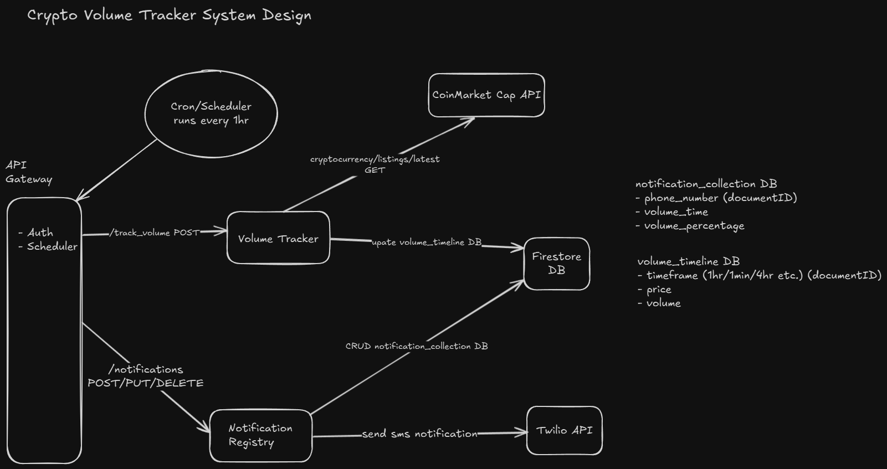

# Crypto Volume Tracker

## Features
- Tracks volume for crypto coins based on your provided threshold every 15min (Scheduler runs every 15min)
- Once threshold is reached, it sends SMS to your phone
- Easy to setup. Just need to define your volume thresholds and register your phone on notification service <br/>
**Registration example** <br/>
*Below example will send sms notification to the given phone number whenever any crypto coin has a positive volume change of 20% for 1hr chart*
```
{
    "phone": "+11234567895", // Send sms to this phone
    "volume_percentage": "20", // Represents 20%
    "volume_time": "1hr" // can be 1min, 3min, 5min, 1hr, 4hr etc.
}
```

## High Level System Design
